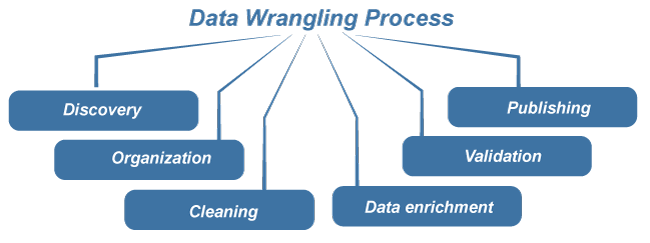

## DATA WRANGLING
Data wrangling, also known as data preprocessing, is the process of cleaning, structuring, and transforming raw data into a format that is suitable for analysis and modeling. Data Wrangling is also known as Data Munging.

## STEPS:
1. DISCOVERY
In the discovery stage, you'll essentially prepare yourself for rest of the process. Here, you'll think about the questions you want to answer and the type of data you'll need in order to answer them. You'll also locate the data you plan to use and examine its current form in order to figure out how you'll clean, structure, and organize your data in the following stages.

2. TRANSFORMATION
During the transformation stage, you'll act on the plan you developed during the discovery stage. This piece of the process can be broken down into four components: structuring, normalizing and denormalizing, cleaning, and enriching.

Data structuring

When you structure data, you make sure that your various datasets are in compatible formats. This way, when you combine or merge data, it's in a form that's appropriate for the analytical model you want to use to interpret the data.

Normalizing and denormalizing data

Data normalization involves organizing your data into a coherent database and getting rid of irrelevant or repetitive data. Denormalization involves combining multiple tables or relational databases, making the analysis process quicker. Keep your analysis goal and business users in mind as you think about normalization and denormalization.

Data cleaning

During the cleaning process, you remove errors that might distort or damage the accuracy of your analysis. This includes tasks like standardizing inputs, deleting duplicate values or empty cells, removing outliers, fixing inaccuracies, and addressing biases. Ultimately, the goal is to make sure the data is as error-free as possible.

Enriching data

Once you've transformed your data into a more usable form, consider whether you have all the data you need for your analysis. If you don't, you can enrich it by adding values from other datasets. You also may want to add metadata to your database at this point.

3. VALIDATION
During the validation step, you essentially check the work you did during the transformation stage, verifying that your data is consistent, of sufficient quality, and secure. This step may be completed using automated processes and can require some programming skills.

4. PUBLISHING
After you've finished validating your data, you're ready to publish it. When you publish data, you'll put it into whatever file format you prefer for sharing with other team members for downstream analysis purposes.

## TEXT PREPROCESSING
Find the docs for some learnings about text cleaning and preprocessing [here](https://acute-spandex-e89.notion.site/Text-Cleaning-cee2e2dec6e449288db567feee3063a7?pvs=4).